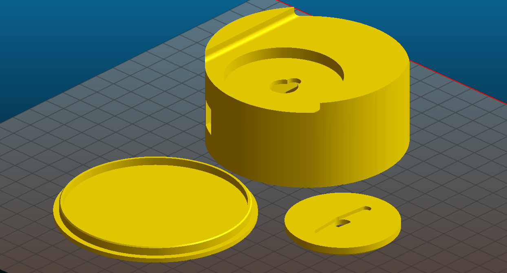
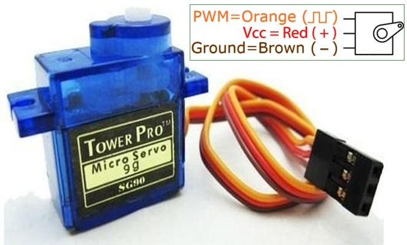
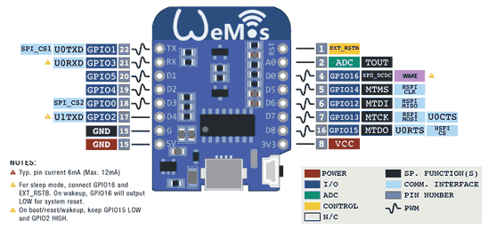
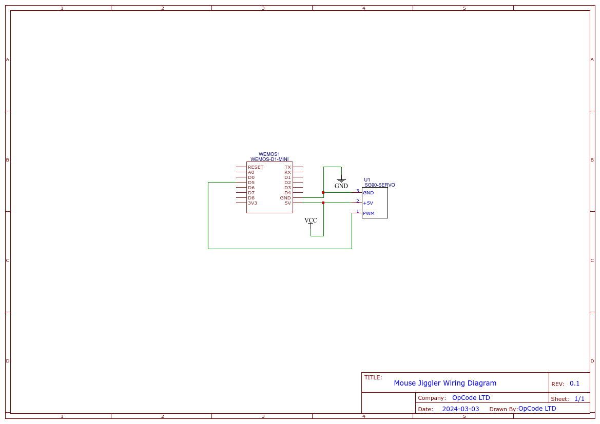

# MouseJiggler

Example Mouse Jiggler for ESP8266 WEMOS D1 using the PlatformIO IDE plugin for VSCode

### 3D Print Preview    

### Parts List
- Micro Servo SG90
    
    

- Wemos D1 Mini

    

### Wiring Diagram

